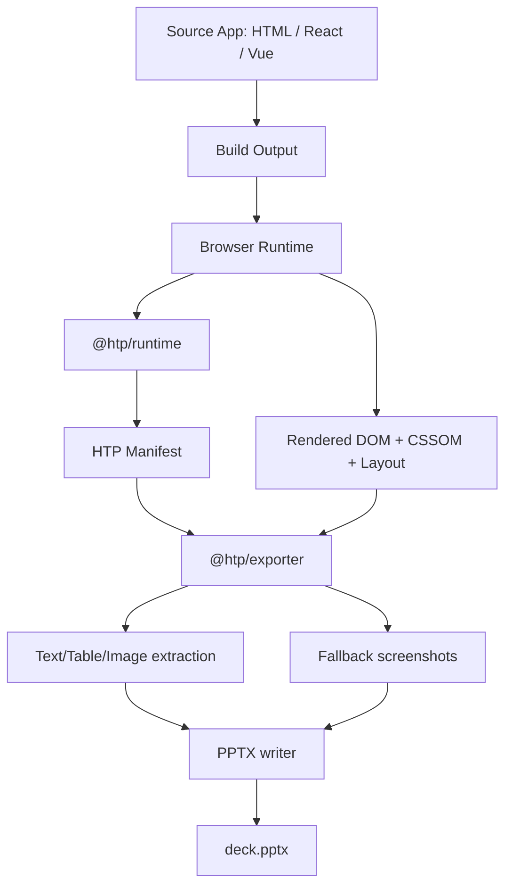
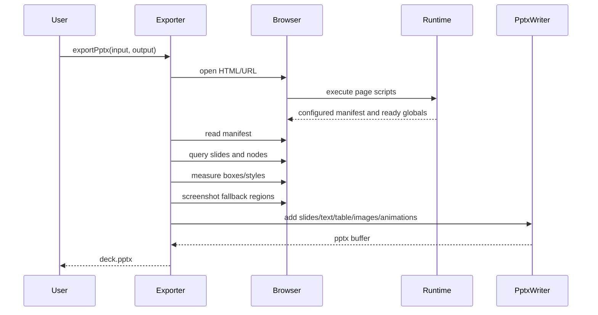

# HTP: HTML To PowerPoint 技术报告

日期：2026-06-29  
项目暂定名：HTP, HTML To PowerPoint  
目标产物：

1. `@htp/exporter`：HTML 到 PPTX 的打包/导出工具，可作为 CLI、构建插件、Node 函数使用。
2. `@htp/runtime`：类似 GSAP 的纯 JS 驱动库，用于标注可转换对象和声明可无缝映射到 PowerPoint 的动画。

---

## 1. 项目定位

HTP 的核心目标不是“任意 HTML 全量无损转 PPTX”，而是：

> 用浏览器完成 Web 渲染，用 PPTX 完成交付；在保持高视觉保真的同时，让文本、表格、图片和有限动画成为 PowerPoint 原生可编辑对象。

第一阶段应避免双向转换、复杂 shape 还原、任意 CSS 动画解析。更合理的 MVP 是：

```text
HTML / React / Vue / Svelte / Static Page
        ↓
浏览器渲染和布局
        ↓
HTP runtime 标注语义和动画
        ↓
HTP exporter 读取 DOM + manifest + layout
        ↓
PPTX
```

最终用户不需要学习一套复杂 slide DSL。用户可以继续写普通网页，只需要像使用 GSAP 一样，通过 JS 给 DOM 节点声明 PPT 导出语义：

```js
import { htp } from "@htp/runtime";

htp.slide(".slide");
htp.text("#title");
htp.table("#revenue-table");
htp.image("#hero");
htp.fallback(".complex-visual");

htp.animate("#title", {
  effect: "fade",
  trigger: "click",
  duration: 0.6,
  delay: 0.2
});

htp.ready();
```

---

## 2. 核心判断

### 2.1 为什么单向更适合

双向转换的工程价值较低，尤其是在 React/Vue 等框架场景中：

```text
Vue/React 源码 -> build 后 DOM -> PPTX -> HTML
```

build 后 DOM 已经丢失组件名、props、状态结构、源码路径和业务语义。即使从 PPTX 回到 HTML，也只能得到一个静态页面壳子，无法恢复原工程。

因此 HTP 的第一阶段应坚定做单向：

```text
HTML -> PPTX
```

如需“可回编辑”，未来应围绕项目 IR 或 manifest 做，而不是试图从 PPTX 反推源代码。

### 2.2 为什么图片兜底是正确策略

PowerPoint 的原生对象体系和 HTML/CSS 不是同构的。CSS 的 grid、flex、filter、mask、blend、复杂 SVG、canvas、WebGL、Lottie 动画，都很难稳定转成 PowerPoint 原生对象。

所以 HTP 应采用分层策略：

```text
可稳定映射的对象 -> PPT 原生对象
不可稳定映射的对象 -> 浏览器截图 -> PPT 图片
```

第一版只承诺：

```text
slide -> PPT slide
text  -> PPT text box
table -> PPT table
image -> PPT picture
其他 -> screenshot image
```

这会显著降低实现难度，同时满足真实交付需求。

### 2.3 为什么需要 runtime 库

如果只从 build 后 DOM 猜语义，转换器会非常脆弱。HTP runtime 的作用是让页面在运行后自描述：

```text
DOM
+ configurable marker attributes, for example htp="text"
+ window.__HTP_MANIFEST__
+ window.__HTP_READY__
```

导出器不再靠猜，而是读取 manifest 和浏览器布局结果。

---

## 3. 产品形态

### 3.1 包结构

建议项目采用 monorepo：

```text
htp/
  packages/
    runtime/
      src/
      package.json
    exporter/
      src/
      package.json
    cli/
      src/
      package.json
    vite-plugin/
      src/
      package.json
    core/
      src/
      package.json
  examples/
    vanilla/
    react/
    vue/
    dashboard-report/
  tests/
    fixtures/
    visual/
  docs/
```

### 3.2 包职责

`@htp/core`

```text
类型定义
manifest schema
单位换算
颜色解析
动画枚举
错误码
共享工具函数
```

`@htp/runtime`

```text
运行在浏览器中
提供类似 GSAP 的纯 JS API
给 DOM 节点挂载可配置类型标记，默认只需要 `htp="text"`
生成可配置的全局 manifest，默认 `window.__HTP_MANIFEST__`
声明页面导出就绪状态，默认 `window.__HTP_READY__`
```

`@htp/exporter`

```text
运行在 Node.js 中
使用 Playwright 打开 HTML/URL
读取 manifest、DOM、computed style、bounding box
使用浏览器截图生成图片兜底
使用 PPTX 写入库生成 pptx 文件
```

`@htp/cli`

```text
命令行入口
支持 htp export ./dist/index.html ./deck.pptx
支持 URL、HTML 文件、目录输入
```

`@htp/vite-plugin`

```text
构建集成
在 vite build 后自动调用 exporter
适合用户把 PPTX 当作 build artifact 输出
```

---

## 4. 总体架构



关键点：

1. 浏览器是排版器，不自己实现 CSS layout。
2. runtime 是语义层，不负责生成 PPTX。
3. exporter 是转换层，读取最终渲染结果。
4. 未定义或不可映射内容用截图兜底。
5. 动画从 HTP DSL 映射，不从任意 CSS animation 反推。

---

## 5. Runtime 设计

### 5.1 设计目标

`@htp/runtime` 应该像 GSAP 一样轻：

```js
htp.text("#title");
htp.animate("#title", { effect: "fade" });
```

它不应该要求用户改造组件结构，也不应该强制使用 React/Vue 组件。

### 5.2 最小 API

```ts
interface HtpRuntime {
  slide(target: Target, options?: SlideOptions): HtpSelection;
  text(target: Target, options?: TextOptions): HtpSelection;
  table(target: Target, options?: TableOptions): HtpSelection;
  image(target: Target, options?: ImageOptions): HtpSelection;
  fallback(target: Target, options?: FallbackOptions): HtpSelection;
  animate(target: Target, options: AnimationOptions): HtpSelection;
  auto(options?: AutoOptions): void;
  ready(options?: ReadyOptions): void;
  getManifest(): HtpManifest;
}

type Target = string | Element | Element[] | NodeList | HtpSelection;
```

### 5.3 使用示例

```html
<section class="slide">
  <h1 id="title">Q2 Growth Review</h1>
  <div class="chart-card">
    <canvas id="chart"></canvas>
  </div>
  <table id="revenue-table">
    <tr><th>Quarter</th><th>Revenue</th></tr>
    <tr><td>Q1</td><td>$1.2M</td></tr>
  </table>
</section>

<script type="module">
  import { htp } from "@htp/runtime";

  htp.slide(".slide", { id: "slide-1" });
  htp.text("#title", { id: "title" });
  htp.table("#revenue-table", { id: "revenue" });
  htp.fallback(".chart-card", { id: "chart-card" });

  htp.animate("#title", {
    effect: "fade",
    trigger: "click",
    duration: 0.6,
    delay: 0.1
  });

  htp.ready();
</script>
```

### 5.4 DOM 标记输出与可配置 Marker

公开 DOM 标记层应尽量克制。默认情况下，用户只需要一个属性来标记节点类型和边界：

```html
<h1 id="title" htp="text">
  Q2 Growth Review
</h1>
```

核心标记只有一个：

```text
htp="slide|text|table|image|fallback"
```

`id` 不应要求用户手动配置。runtime/exporter 可以按以下优先级自动生成节点 id：

```text
1. 用户已有 DOM id，例如 id="title"
2. runtime 通过 selector 注册时生成的内部 id
3. exporter 根据 slide index + DOM path + node order 自动生成
```

动画也不应靠 DOM 属性手写。框架项目应在打包前通过 JS/TS 选择器注册动画，由 runtime 写入 manifest：

```ts
htp.text("#title");
htp.animate("#title", { effect: "fade", duration: 0.6 });
```

打包后的页面运行时，runtime 生成：

```ts
window.__HTP_MANIFEST__ = {
  nodes: [
    { id: "auto_title_1", selector: "#title", type: "text" }
  ],
  animations: [
    { nodeId: "auto_title_1", effect: "fade", duration: 0.6 }
  ]
};
```

用户直接修改静态 HTML 时，也只需要补类型边界：

```html
<section htp="slide">
  <h1 htp="text">年度报告</h1>
  <table htp="table">...</table>
  
  <div htp="fallback">复杂视觉区域</div>
</section>
```

为了避免和业务属性冲突，唯一的类型标记名必须可配置：

```ts
htp.configure({
  marker: {
    typeAttr: "htp"
  }
});
```

如果用户想换成 `ppt`：

```ts
htp.configure({
  marker: {
    typeAttr: "ppt"
  }
});
```

对应 HTML：

```html
<section ppt="slide">
  <h1 ppt="text">Q2 Growth Review</h1>
</section>
```

如果用户偏好标准 `data-*`，也可以配置为：

```ts
htp.configure({
  marker: {
    typeAttr: "data-ppt-type"
  }
});
```

导出器内部不应硬编码属性名，而应通过配置读取：

```ts
interface MarkerConfig {
  typeAttr: string;
}

function getHtpType(el: Element, marker: MarkerConfig) {
  return el.getAttribute(marker.typeAttr);
}
```

如果未来确实需要手动调试或强制稳定 id，可以保留一个高级 escape hatch，例如 `htp.node(el, { id: "title" })` 或 manifest 配置；但它不应成为默认 HTML 协议。
### 5.5 自动作用域隔离

HTP 不能要求用户手动指定 `htp.scope(rootEl)`。在 Vue/React 组件中，用户写在一个组件里的 HTP 注册和动画代码，必须自动限定在当前组件作用域内，效果应类似 Vue scoped CSS。

错误目标：

```ts
// 不应要求用户手动传 rootEl
const scope = htp.scope(rootEl);
scope.text(".title");
```

正确目标：

```ts
// 用户只写普通选择器
htp.text(".title");
htp.animate(".title", { effect: "fade" });
```

经过 HTP 构建插件处理后，这些调用只影响当前组件生成的 DOM 子树，不会扫到全局其他组件。

#### 5.5.1 类 Vue scoped CSS 的实现方式

HTP 应提供编译/构建插件，例如 `@htp/vite-plugin`，在构建阶段给组件生成稳定 scope id：

```text
src/components/MetricCard.vue -> htp-scope="h-a8f31"
src/components/HeroSlide.tsx   -> htp-scope="h-c29d0"
```

Vue SFC 示例，源码：

```vue
<template>
  <section htp="slide">
    <h1 class="title">Q2 Growth Review</h1>
  </section>
</template>

<script setup lang="ts">
import { htp } from "@htp/runtime";

htp.text(".title");
htp.animate(".title", { effect: "fade" });
</script>
```

构建插件处理后的概念结果：

```html
<section htp="slide" htp-scope="h-a8f31">
  <h1 class="title" htp-scope="h-a8f31">Q2 Growth Review</h1>
</section>
```

同时 JS 调用被绑定到当前组件 scope：

```ts
htp.__withScope("h-a8f31").text(".title");
htp.__withScope("h-a8f31").animate(".title", { effect: "fade" });
```

运行时解析：

```text
htp.text(".title")
=> document.querySelectorAll('[htp-scope="h-a8f31"] .title, .title[htp-scope="h-a8f31"]')
```

因此同名 `.title` 在其他组件里不会被选中。

#### 5.5.2 React/TSX 的处理方式

React 没有 Vue SFC 的天然模板编译边界，因此需要 Babel/SWC/Vite transform 辅助。插件可以按文件和组件生成 scope id，并在 JSX 根节点或所有 JSX 元素上注入 scope 属性。

源码：

```tsx
export function HeroSlide() {
  htp.text(".title");
  htp.animate(".title", { effect: "fade" });

  return (
    <section htp="slide">
      <h1 className="title">Q2 Growth Review</h1>
    </section>
  );
}
```

概念转换：

```tsx
export function HeroSlide() {
  const htp = __htp.withScope("h-c29d0");
  htp.text(".title");
  htp.animate(".title", { effect: "fade" });

  return (
    <section htp="slide" htp-scope="h-c29d0">
      <h1 className="title" htp-scope="h-c29d0">Q2 Growth Review</h1>
    </section>
  );
}
```

插件不需要改变业务 className，也不需要用户手写 ref。它只增加 HTP 自己的 scope 属性和 scoped runtime 绑定。

#### 5.5.3 Scope 标记也应可配置

默认 scope 属性可以是：

```html
<div htp-scope="h-a8f31"></div>
```

如果业务已有冲突，应允许配置：

```ts
htpPlugin({
  marker: {
    typeAttr: "htp",
    scopeAttr: "htp-scope"
  }
});
```

也可以换成：

```ts
htpPlugin({
  marker: {
    typeAttr: "ppt",
    scopeAttr: "ppt-scope"
  }
});
```

注意：`scopeAttr` 是编译插件内部用于隔离组件的属性，不是用户需要手写的业务 API。

#### 5.5.4 纯 HTML 与无插件场景

如果用户直接写静态 HTML，没有组件系统，也没有构建插件，则不存在组件作用域问题。此时只需要：

```html
<section htp="slide">
  <h1 htp="text">年度报告</h1>
</section>
```

如果用户在无插件环境中仍然调用 `htp.text(".title")`，它会按全局选择器解析。文档应明确：框架项目推荐通过 `@htp/vite-plugin` 或对应构建插件启用自动作用域隔离。

#### 5.5.5 Manifest 绑定

runtime 最终仍然使用自动 nodeId 绑定动画，不依赖用户手写 id：

```ts
{
  nodes: [
    { id: "node_42", scopeId: "h-a8f31", type: "text", selector: ".title" }
  ],
  animations: [
    { nodeId: "node_42", effect: "fade" }
  ]
}
```

导出器读取的是构建后页面的最终 DOM、scope 标记和 manifest，不从源码静态推断组件结构。

因此 HTP 的原则是：

```text
直接 HTML：手写 htp="text"
框架项目：构建插件自动注入 htp-scope
组件内 htp.text(".title") 自动限定在当前组件 scope
id 和动画绑定由 runtime 自动生成并写入 manifest
```
### 5.6 Manifest 输出

```ts
interface HtpManifest {
  version: string;
  createdAt?: string;
  deck: DeckOptions;
  slides: HtpSlideNode[];
  nodes: HtpNode[];
  animations: HtpAnimation[];
  assets?: HtpAsset[];
}
```

示例：

```json
{
  "version": "0.1.0",
  "deck": {
    "width": 13.333,
    "height": 7.5,
    "unit": "in",
    "layout": "LAYOUT_WIDE"
  },
  "slides": [
    {
      "id": "slide-1",
      "selector": ".slide"
    }
  ],
  "nodes": [
    {
      "id": "title",
      "type": "text",
      "selector": "#title",
      "slideId": "slide-1",
      "editable": true
    },
    {
      "id": "chart-card",
      "type": "fallback",
      "selector": ".chart-card",
      "slideId": "slide-1"
    }
  ],
  "animations": [
    {
      "nodeId": "title",
      "effect": "fade",
      "trigger": "click",
      "duration": 0.6,
      "delay": 0.1
    }
  ]
}
```

### 5.7 Ready 机制

导出时不能太早截图，否则图片、字体、图表、异步数据可能还没渲染完。

runtime 应提供：

```js
htp.ready();
```

内部设置：

```js
window[config.globals.ready || "__HTP_READY__"] = true;
```

导出器等待：

```js
await page.waitForFunction((readyKey) => window[readyKey] === true, config.globals.ready);
await page.evaluate(() => document.fonts?.ready);
await page.waitForLoadState("networkidle");
```

也可以支持：

```js
htp.ready(async () => {
  await loadData();
  await renderCharts();
});
```

---

## 6. Exporter 设计

### 6.1 使用方式

作为函数使用：

```ts
import { exportPptx } from "@htp/exporter";

await exportPptx({
  input: "./dist/index.html",
  output: "./deck.pptx",
  viewport: { width: 1920, height: 1080 },
  waitUntil: "htp-ready"
});
```

作为 URL 使用：

```ts
await exportPptx({
  input: "http://localhost:5173",
  output: "./deck.pptx"
});
```

作为构建插件使用：

```ts
// vite.config.ts
import { htpPlugin } from "@htp/vite-plugin";

export default {
  plugins: [
    htpPlugin({
      input: "dist/index.html",
      output: "dist/deck.pptx"
    })
  ]
};
```

作为 CLI 使用：

```bash
htp export ./dist/index.html ./deck.pptx
htp export http://localhost:5173 ./deck.pptx
```

### 6.2 导出流程



### 6.3 输入解析

`input` 支持：

```text
本地 HTML 文件
本地目录
HTTP/HTTPS URL
HTML 字符串
```

本地 HTML 文件应自动处理相对依赖：

```text
./dist/index.html
./dist/assets/index-abc.js
./dist/assets/style-xyz.css
```

实现方式：

1. 如果 input 是文件路径，用静态服务器托管该文件所在目录。
2. 用 Playwright 访问本地服务器 URL。
3. 浏览器自然加载 JS/CSS/图片/字体等依赖。

不要自己解析 HTML 并手工拼接依赖。让浏览器加载更稳。

### 6.4 页面尺寸与单位换算

推荐默认：

```text
Browser viewport: 1920 x 1080 px
PowerPoint size: 13.333 x 7.5 in
```

换算：

```text
x_in = x_px / viewportWidth * pptWidthIn
y_in = y_px / viewportHeight * pptHeightIn
w_in = w_px / viewportWidth * pptWidthIn
h_in = h_px / viewportHeight * pptHeightIn
```

PPTX 内部使用 EMU，但大多数 JS 写入库接受 inches。

### 6.5 Slide 识别

优先级：

1. manifest 中的 slides。
2. 当前 marker 配置匹配的 slide 节点，例如默认 `[htp="slide"]`，或用户配置后的 `[ppt="slide"]` / `[data-ppt-type="slide"]`。
3. `.slide` 作为 fallback。
4. 整个 body 作为单页。

每个 slide 对应一个固定画布区域。用户应确保每个 slide 的宽高比例一致。

### 6.6 节点分类

支持类型：

```text
slide
text
table
image
fallback
```

推荐第一阶段只实现这五类。

### 6.7 层级策略

PPTX 对象的绘制顺序很重要。导出器需要尽量还原 DOM 视觉层级。

建议初版策略：

1. 先处理 slide 背景截图。
2. 再处理 fallback 图片。
3. 再处理 image。
4. 再处理 table。
5. 最后处理 text。

更精确版本可读取：

```text
z-index
DOM order
stacking context
position
opacity
transform
```

但第一版不要过度追求完整 CSS stacking context。

### 6.8 避免文本重复的截图策略

如果整页截图后再叠加可编辑文本，会出现文本重复。

推荐做法：

```text
截图前临时隐藏可编辑节点
截图得到背景层
恢复节点
导出可编辑 text/table/image
```

伪代码：

```ts
await page.evaluate(() => {
  for (const el of marker.queryEditableNodes(document)) {
    marker.setHiddenForShot(el, true);
    el.style.visibility = "hidden";
  }
});

const bg = await slideElement.screenshot();

await page.evaluate(() => {
  for (const el of marker.queryHiddenForShotNodes(document)) {
    el.style.visibility = "";
    marker.setHiddenForShot(el, false);
  }
});
```

更高级的版本可以只隐藏指定 slide 内的 editable 节点。

### 6.9 Fallback 策略

对于未标注或显式 fallback 区域：

```text
DOM node -> Playwright element screenshot -> PNG -> PPT image
```

不要优先使用 html2canvas。浏览器原生截图对 CSS、字体、SVG、canvas、伪元素、滤镜支持更可靠。

### 6.10 Text 导出

初版只做简单文本框：

```text
innerText
font-family
font-size
font-weight
font-style
color
text-align
line-height
```

注意点：

1. 浏览器和 PowerPoint 字体度量不同，换行可能不一致。
2. 可编辑性和视觉一致性有冲突。
3. 可以提供 `textMode` 选项：

```ts
textMode: "editable" | "image" | "both"
```

`both` 表示保留背景截图中的视觉文本，同时叠加透明/近似文本框，用于搜索和轻量编辑。但第一版不建议默认开启。

### 6.11 Table 导出

HTML table 到 PPT table 是高价值能力。

初版支持：

```text
thead/tbody/tr/td/th
文本内容
背景色
字体颜色
字体大小
水平对齐
基础边框
colspan/rowspan 可先不支持或降级为图片
```

遇到复杂 table：

```text
无法稳定映射 -> fallback screenshot
```

### 6.12 Image 导出

`` 可以自动识别，也可通过 `htp.image()` 显式声明。

需要处理：

```text
src
object-fit
object-position
border-radius
clip
opacity
```

第一版可先把图片节点截图成图片，而不是提取原图资源。这样可以自然包含裁剪、圆角、滤镜和叠加效果。

如果用户要求可替换原图，未来再支持原始图片嵌入。

---

## 7. 动画系统设计

### 7.1 动画路线

HTP 动画不应尝试解析任意 CSS animation。正确路线是：

```text
HTP Animation DSL
  -> Web preview animation
  -> PPT native animation
```

也就是说，Web 端和 PPT 端都从同一套动画描述生成。

### 7.2 可原生映射的动画

第一批支持：

```text
appear
fade
fly-left
fly-right
fly-up
fly-down
zoom-in
zoom-out
grow
shrink
spin
wipe-left
wipe-right
wipe-up
wipe-down
motion-line
```

这些可以映射到 PowerPoint 的原生动画效果或基本动画行为。

微软 PowerPoint 对象模型中，动画可通过 `Sequence.AddEffect` 加到 shape 上，效果来自 `MsoAnimEffect`。另外还有 motion、scale、rotation、property/color 等行为。参考：

- PowerPoint `Sequence.AddEffect`: https://learn.microsoft.com/en-us/office/vba/api/powerpoint.sequence.addeffect
- Office `MsoAnimEffect`: https://learn.microsoft.com/en-us/office/vba/api/office.msoanimeffect
- PowerPoint `MotionEffect`: https://learn.microsoft.com/en-us/office/vba/api/powerpoint.motioneffect
- PowerPoint `ScaleEffect`: https://learn.microsoft.com/en-us/office/vba/api/powerpoint.scaleeffect
- PowerPoint `RotationEffect`: https://learn.microsoft.com/en-us/office/vba/api/powerpoint.rotationeffect

### 7.3 动画 API

```ts
htp.animate("#title", {
  effect: "fade",
  trigger: "click",
  duration: 0.6,
  delay: 0.2,
  easing: "easeOut"
});
```

类型：

```ts
type HtpAnimationEffect =
  | "appear"
  | "fade"
  | "fly-left"
  | "fly-right"
  | "fly-up"
  | "fly-down"
  | "zoom-in"
  | "zoom-out"
  | "grow"
  | "shrink"
  | "spin"
  | "wipe-left"
  | "wipe-right"
  | "wipe-up"
  | "wipe-down"
  | "motion-line";

interface AnimationOptions {
  id?: string;
  effect: HtpAnimationEffect;
  trigger?: "click" | "withPrevious" | "afterPrevious";
  duration?: number;
  delay?: number;
  easing?: "linear" | "easeIn" | "easeOut" | "easeInOut";
  order?: number;
  from?: { x?: number; y?: number; scale?: number; rotate?: number; opacity?: number };
  to?: { x?: number; y?: number; scale?: number; rotate?: number; opacity?: number };
  fallback?: "native" | "video" | "none";
}
```

### 7.4 复杂动画兜底

对于 Lottie、canvas、Three.js、SVG path morph、粒子、filter、复杂 CSS keyframes：

```js
htp.animate("#lottie", {
  export: "video",
  duration: 4
});
```

导出器可以录制节点区域为 MP4/GIF，插入 PPT。

注意：视频兜底不属于“原生 PPT 动画”，但适合作为高级能力。

### 7.5 Web 预览

runtime 可以提供：

```js
htp.play();
htp.pause();
htp.seek(0.5);
```

但 MVP 不必实现完整时间轴。第一版只需让动画声明能被 exporter 读取，并可选用 CSS class 做简单预览。

---

## 8. Build Tool 集成

### 8.1 Vite 插件

目标：

```ts
import { htpPlugin } from "@htp/vite-plugin";

export default {
  plugins: [
    htpPlugin({
      entry: "index.html",
      output: "dist/deck.pptx",
      afterBuild: true
    })
  ]
};
```

插件行为：

1. 等待 Vite build 完成。
2. 启动静态服务器托管 `dist`。
3. 调用 `exportPptx({ input: localUrl, output })`。
4. 关闭服务器。

### 8.2 通用构建集成

对 Webpack、Rspack、Next、Nuxt、Astro，不建议第一版分别写插件。

先提供通用 CLI：

```json
{
  "scripts": {
    "build": "vite build",
    "export:pptx": "htp export ./dist/index.html ./dist/deck.pptx",
    "build:pptx": "npm run build && npm run export:pptx"
  }
}
```

后续按用户需求扩展插件。

---

## 9. 函数式 API 设计

```ts
interface ExportPptxOptions {
  input: string | Buffer;
  output?: string;
  cwd?: string;
  viewport?: {
    width: number;
    height: number;
  };
  deck?: {
    width?: number;
    height?: number;
    layout?: "wide" | "standard" | "custom";
  };
  waitUntil?: "load" | "networkidle" | "htp-ready";
  timeout?: number;
  text?: {
    defaultMode?: "editable" | "image";
    preserveLineBreaks?: boolean;
  };
  fallback?: {
    format?: "png" | "jpeg";
    scale?: number;
    quality?: number;
  };
  animation?: {
    mode?: "native" | "video" | "none";
  };
  debug?: {
    outputDir?: string;
    saveScreenshots?: boolean;
    saveManifest?: boolean;
  };
}

declare function exportPptx(options: ExportPptxOptions): Promise<{
  buffer: Buffer;
  output?: string;
  manifest: HtpManifest;
  warnings: HtpWarning[];
}>;
```

函数应支持：

```ts
const result = await exportPptx({
  input: "./dist/index.html"
});

await fs.promises.writeFile("./deck.pptx", result.buffer);
```

---

## 10. CLI 设计

```bash
htp export <input> <output>
```

示例：

```bash
htp export ./dist/index.html ./deck.pptx
htp export http://localhost:5173 ./deck.pptx
htp export ./dist/index.html ./deck.pptx --viewport 1920x1080
htp export ./dist/index.html ./deck.pptx --debug ./debug
```

参数：

```text
--viewport 1920x1080
--layout wide|standard
--wait htp-ready|networkidle|load
--text editable|image
--animation native|video|none
--debug <dir>
--timeout <ms>
```

---

## 11. PPTX 自研写入层

### 11.1 技术路线

HTP 的 PPTX 生成部分应作为自研转换层实现，而不是把 PptxGenJS 作为核心依赖。PptxGenJS 可以作为早期对照、测试参考或临时 PoC，但正式架构中应由 `@htp/pptx` 直接生成 Office Open XML / PresentationML 包。

理由：

```text
PPTX 是 HTP 的核心交付格式，不能被第三方库的对象模型限制
动画、关系文件、custom data、精细文本属性很可能需要直接写 XML
自研层可以保证 runtime manifest 到 PPTX 底层结构的映射稳定可控
未来商业化时，自研写入层更容易形成技术壁垒
```

### 11.2 PPTX 底层结构

PPTX 本质是 zip 包，内部由 Open XML part 组成。`@htp/pptx` 至少需要生成：

```text
[Content_Types].xml
_rels/.rels
docProps/core.xml
docProps/app.xml
ppt/presentation.xml
ppt/_rels/presentation.xml.rels
ppt/slides/slide1.xml
ppt/slides/_rels/slide1.xml.rels
ppt/slideLayouts/...
ppt/slideMasters/...
ppt/theme/theme1.xml
ppt/media/...
```

第一版可以只生成最小可被 PowerPoint 打开的结构：

```text
presentation
slides
blank master/layout
theme
images
text boxes
tables
basic timing/animation, if enabled
```

### 11.3 HTP Object Model

`@htp/exporter` 不应直接拼 XML，而应生成中间对象模型，再交给 `@htp/pptx`：

```ts
interface HtpPptxDeck {
  width: number;
  height: number;
  slides: HtpPptxSlide[];
  theme?: HtpPptxTheme;
}

interface HtpPptxSlide {
  id: string;
  background?: HtpPptxImage;
  objects: HtpPptxObject[];
  animations?: HtpPptxAnimation[];
}

type HtpPptxObject =
  | HtpPptxTextBox
  | HtpPptxTable
  | HtpPptxImage;
```

这样 exporter 只关心：

```text
DOM/layout/screenshot -> HTP PPTX object model
```

`@htp/pptx` 只关心：

```text
HTP PPTX object model -> Open XML parts
```

### 11.4 坐标系统

浏览器侧使用 px，PPTX 底层使用 EMU。

常量：

```text
1 inch = 914400 EMU
1 point = 12700 EMU
```

换算：

```ts
const emuX = xPx / viewportWidth * deckWidthIn * 914400;
const emuY = yPx / viewportHeight * deckHeightIn * 914400;
```

`@htp/exporter` 可以传 inches，`@htp/pptx` 内部统一转换为 EMU。

### 11.5 文本写入

文本框需要映射到 slide shape tree：

```text
p:sp
  p:nvSpPr
  p:spPr
    a:xfrm
    a:prstGeom
  p:txBody
    a:bodyPr
    a:lstStyle
    a:p
      a:r
        a:rPr
        a:t
```

第一版支持：

```text
x/y/w/h
font family
font size
bold/italic
color
alignment
line spacing
paragraph text
```

复杂 rich text 可以后续支持 text runs。

### 11.6 图片写入

图片写入需要：

```text
ppt/media/image1.png
slide1.xml.rels 中创建 rId
slide1.xml 中创建 p:pic
```

图片对象应支持：

```text
x/y/w/h
crop
opacity
alt text
z order
```

fallback screenshot 和原始 image 节点都可以走同一套 image part 写入逻辑。

### 11.7 表格写入

表格可映射为 DrawingML table：

```text
p:graphicFrame
  a:graphic
    a:graphicData uri=".../table"
      a:tbl
```

第一版支持：

```text
rows / cols
cell text
cell fill
font style
border
alignment
```

`rowspan/colspan`、复杂 border collapse、嵌套元素可以先降级为图片。

### 11.8 动画写入

原生动画需要写入 PresentationML timing 结构，属于自研层最重要的壁垒之一。建议从少量效果开始：

```text
appear
fade
fly
wipe
zoom
spin
```

实现策略：

```text
HTP animation DSL -> PPT timing node -> shape id binding
```

如果某个效果无法稳定写入，导出器应给 warning，并按配置降级为静态或视频。

### 11.9 与第三方库的关系

允许在 PoC 阶段用 PptxGenJS 对照验证，但正式架构建议：

```text
@htp/pptx 是核心生产路径
PptxGenJS 仅作为参考实现/测试 oracle/临时 adapter
```

这样项目不会被第三方库的动画支持、XML 细节、对象抽象和 bug 修复节奏绑定。

参考：

- Microsoft Open XML PresentationML: https://learn.microsoft.com/en-us/office/open-xml/presentation/working-with-presentations
- Office Open XML SDK 文档可作为底层结构参考，即使最终实现使用 TypeScript 直接写 XML

---

## 12. 质量与兼容性

### 12.1 视觉 Diff

导出质量需要自动化验证。

流程：

```text
原 HTML slide 截图
导出 PPTX
将 PPTX 转成图片
对比两张图
输出 diff
```

PPTX 转图片的实现可选：

```text
LibreOffice headless
PowerPoint COM automation（Windows）
云端 Office 渲染服务
```

MVP 可先只保存 HTML 原图和 PPTX，人工比较。

### 12.2 Debug 输出

建议 `--debug` 输出：

```text
manifest.json
slide-1-original.png
slide-1-background.png
slide-1-node-map.json
warnings.json
```

这对早期排查非常重要。

### 12.3 常见 Warning

```text
HTP_TEXT_WRAP_MISMATCH_RISK
HTP_TABLE_ROWSPAN_UNSUPPORTED
HTP_ANIMATION_FALLBACK_TO_VIDEO
HTP_NODE_SCREENSHOT_FAILED
HTP_FONT_NOT_LOADED
HTP_REMOTE_ASSET_TIMEOUT
HTP_UNSUPPORTED_TRANSFORM
```

---

## 13. 边界与降级策略

### 13.1 文本

可编辑文本可能和浏览器视觉有差异。策略：

```text
默认导出可编辑文本
允许用户设置某些文本为 fallback image
提供调试截图检查差异
```

### 13.2 表格

复杂表格可降级：

```text
简单 table -> PPT table
复杂 table -> screenshot image
```

### 13.3 图片

节点截图优先，保证视觉。未来再支持原图嵌入和替换。

### 13.4 Shape

第一阶段不支持 shape。所有图形、卡片、背景块、SVG 默认截图。

未来如需扩展，只加入高收益基础形状：

```text
rect
round-rect
line
```

### 13.5 动画

```text
HTP DSL 内动画 -> PPT native
复杂 Web 动画 -> video/GIF
未声明 CSS animation -> 静态截图
```

---

## 14. MVP 开发计划

### Phase 0: Proof of Concept

目标：证明 HTML 可导出 PPTX。

功能：

```text
读取本地 HTML
Playwright 打开页面
识别 slide
整页截图
生成单页/多页 PPTX
```

完成标准：

```text
htp export ./example.html ./deck.pptx
```

### Phase 1: 可编辑文本

功能：

```text
@htp/runtime: slide/text/ready
@htp/exporter: 读取 manifest
文本节点导出为 PPT text box
截图前隐藏文本，避免重复
```

完成标准：

```text
PPT 中标题和正文可编辑
背景视觉保真
```

### Phase 2: 表格和图片

功能：

```text
table -> PPT table
img/image -> PPT picture or screenshot
fallback node -> screenshot
```

完成标准：

```text
报告类页面能导出为可交付 PPTX
```

### Phase 3: CLI 与函数 API

功能：

```text
Node API
CLI
本地静态服务器
debug 输出
warning 系统
```

完成标准：

```text
可发布 npm alpha
```

### Phase 4: 动画 DSL

功能：

```text
htp.animate()
fade/appear/fly/zoom/wipe/spin
导出 PPT native animation
```

完成标准：

```text
PPT 动画窗格中可见并可编辑动画
```

### Phase 5: 构建插件

功能：

```text
Vite plugin
build 后自动输出 pptx
```

完成标准：

```text
npm run build 后同时得到 dist/deck.pptx
```

---

## 15. 商业化建议

适合作为开发者工具和 API，而不是一开始做完整 AI PPT 应用。

产品线：

```text
开源：@htp/runtime + 基础 CLI
付费：高级 exporter、批量导出、动画、云端 API、私有化部署
```

目标客户：

```text
AI PPT 产品团队
AI 报告生成工具
BI/数据看板导出场景
咨询/投研自动化报告
企业周报/月报生成系统
```

早期卖点：

```text
Build with HTML. Ship as PowerPoint.
Web 视觉高保真
文本和表格可编辑
动画可映射到 PPT 原生效果
Node API / CLI / Build plugin
```

不要承诺：

```text
任意 HTML 全可编辑
任意 CSS 动画完全还原
双向无损转换
所有 PowerPoint shape 支持
```

---

## 16. 技术风险

### 高风险

```text
PowerPoint 动画 XML 写入复杂
文本换行与浏览器不一致
不同 Office/WPS/Keynote 渲染差异
大规模截图导致 PPTX 体积过大
远程字体和跨域资源加载失败
复杂 stacking context 层级还原不完整
```

### 中风险

```text
表格合并单元格
图片裁剪和 object-fit
透明背景截图
高 DPI 截图体积
构建工具路径兼容
```

### 低风险

```text
slide 识别
整页截图
基础 text box
基础 image
CLI 包装
```

---

## 17. 推荐技术栈

```text
语言：TypeScript
浏览器自动化：Playwright
PPTX 生成：自研 @htp/pptx，直接写 Office Open XML / PresentationML
CLI：commander 或 cac
本地服务器：sirv / serve-handler / express
构建：tsup
测试：vitest
视觉测试：pixelmatch / resemblejs
Monorepo：pnpm workspace / turborepo
```

---

## 18. 项目命名建议

暂定名：

```text
HTP
HTML To PowerPoint
```

包名建议：

```text
@htp/core
@htp/runtime
@htp/exporter
@htp/cli
@htp/vite-plugin
```

如果 npm 包名冲突，可考虑：

```text
html-to-powerpoint
htmlppt
web2pptx
htp-export
```

---

## 19. 最小示例

### 19.1 HTML 页面

```html
<!doctype html>
<html>
  <head>
    <meta charset="utf-8" />
    <title>HTP Demo</title>
    <style>
      .slide {
        width: 1920px;
        height: 1080px;
        position: relative;
        background: #f7f8fb;
        overflow: hidden;
      }

      #title {
        position: absolute;
        left: 120px;
        top: 90px;
        font-size: 72px;
        font-family: Arial, sans-serif;
        color: #15171a;
      }

      .visual {
        position: absolute;
        left: 120px;
        top: 240px;
        width: 760px;
        height: 500px;
        background: linear-gradient(135deg, #28d6a3, #2f6df6);
        border-radius: 24px;
      }

      table {
        position: absolute;
        left: 980px;
        top: 260px;
        width: 760px;
        border-collapse: collapse;
        font-size: 32px;
      }

      td, th {
        border: 1px solid #c9ced8;
        padding: 18px;
      }
    </style>
  </head>
  <body>
    <section class="slide">
      <h1 id="title">Q2 Growth Review</h1>
      <div class="visual"></div>
      <table id="metrics">
        <tr><th>Metric</th><th>Value</th></tr>
        <tr><td>Revenue</td><td>$1.2M</td></tr>
        <tr><td>Growth</td><td>28%</td></tr>
      </table>
    </section>

    <script type="module">
      import { htp } from "@htp/runtime";

      htp.slide(".slide");
      htp.text("#title");
      htp.table("#metrics");
      htp.fallback(".visual");
      htp.animate("#title", { effect: "fade", duration: 0.6 });
      htp.ready();
    </script>
  </body>
</html>
```

### 19.2 导出

```bash
htp export ./dist/index.html ./deck.pptx
```

### 19.3 Node API

```ts
import { exportPptx } from "@htp/exporter";

await exportPptx({
  input: "./dist/index.html",
  output: "./deck.pptx",
  animation: { mode: "native" },
  debug: { outputDir: "./debug", saveScreenshots: true }
});
```

---

## 20. 结论

HTP 最优雅、最现实的路线是：

```text
纯 JS runtime 负责声明 PPT 语义和动画
浏览器负责真实渲染和布局
exporter 负责读取渲染结果并生成 PPTX
文本/表格/图片/有限动画原生化
复杂视觉全部截图兜底
```

这条路线的优势是：

1. 对前端框架无侵入。
2. 可作为 CLI、构建插件、Node 函数使用。
3. 适合 AI 生成 HTML 后导出 PPTX。
4. 工程难度可控。
5. 商业定位清晰。

第一版不要追求“无损”和“双向”。真正应该打穿的是：

> 任意 Web 页面可以稳定导出为 PPTX，其中关键文本、表格、图片和有限动画是 PowerPoint 原生对象，其余视觉由浏览器截图高保真保留。

